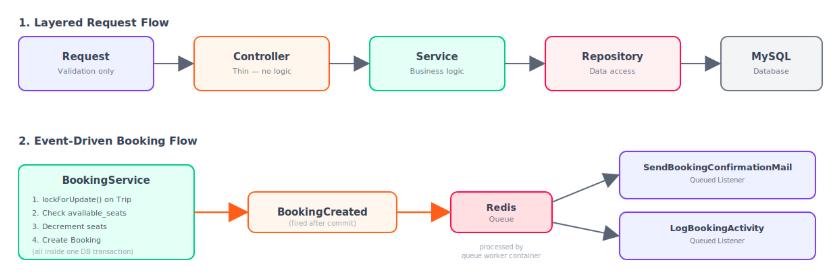
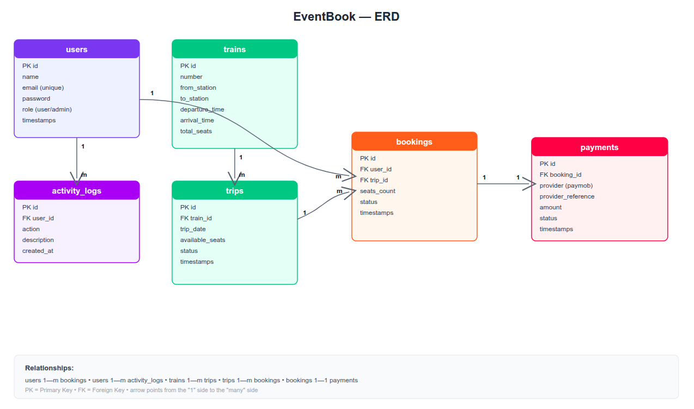

# EventBook — Event-Driven Train Booking System
 
EventBook is a Laravel-based backend API for booking train seats between Egyptian cities. It's built as a portfolio project to demonstrate a clean, layered architecture combined with an **event-driven design** — the core mechanism used to decouple side effects (notifications, activity logging, seat availability updates) from the main booking flow.
 
## Architecture
 


## Database Design



The project follows a strict layered architecture on every module:
 
```
Request (validation) → Controller (thin) → Service (business logic) → Repository (data access)
```
 
Business-critical events (booking creation, cancellation) fire domain **Events**, which are picked up by multiple independent, queued **Listeners** — each handling a single responsibility (sending a confirmation email, logging the activity). This keeps the core booking flow fast and decoupled from side effects.
 
## Key Features
 
- **JWT Authentication** — register, login, logout, and OTP-based password reset (email delivered via Mailtrap)
- **Trains & Trips** — searchable trips with optional filters (date, from/to station)
- **Event-driven Booking** — booking creation triggers a `BookingCreated` event handled asynchronously by queued listeners (email confirmation, activity logging)
- **Race-condition-safe seat reservation** — uses `lockForUpdate()` inside a database transaction to prevent double-booking when multiple users book the same trip simultaneously
- **Payment integration (Paymob)** — mobile wallet payment flow (Vodafone Cash) with HMAC-verified webhook callbacks
- **Activity logging** — tracks user actions (register, login, bookings, payments) including failed attempts
- **Dockerized environment** — PHP 8.3, Nginx, MySQL, Redis (queue driver), phpMyAdmin, and a dedicated queue worker container
## Tech Stack
 
| Layer | Technology |
|---|---|
| Framework | Laravel 12 |
| Language | PHP 8.3 |
| Database | MySQL 8 |
| Queue / Cache | Redis |
| Auth | JWT (tymon/jwt-auth) |
| Mail (dev) | Mailtrap |
| Payments | Paymob (Mobile Wallet) |
| Containerization | Docker & Docker Compose |
 
## Getting Started
 
### Prerequisites
- Docker & Docker Compose
- Composer & PHP (for initial `composer create-project`, if starting fresh)
### Setup
 
```bash
# 1. Clone the repository
git clone https://github.com/Amr-Khaled9/EventBook.git
cd EventBook
 
# 2. Copy environment file and configure it
cp .env.example .env
# Fill in DB, Redis, Mailtrap, and Paymob credentials
 
# 3. Build and start containers
docker compose up -d --build
 
# 4. Install dependencies (if not already vendored)
docker compose exec app composer install
 
# 5. Generate app key
docker compose exec app php artisan key:generate
 
# 6. Generate JWT secret
docker compose exec app php artisan jwt:secret
 
# 7. Run migrations and seed sample data
docker compose exec app php artisan migrate --seed
```
 
The app will be available at `http://localhost:8000`, and phpMyAdmin at `http://localhost:8080`.
 
> **Note:** The `queue` container must be running for event listeners (emails, activity logs) to actually process — this happens automatically with `docker compose up -d`.
 
## API Testing

A Postman collection is available at `docs/postman/EventBook.postman_collection.json` — import it to test all endpoints directly.
 
1. Open Postman → **Import**
2. Select `docs/postman/EventBook.postman_collection.json`
3. Start with the **Register** or **Login** request — the returned token is used automatically in subsequent requests
## Running Tests
 
```bash
docker compose exec app php artisan test
```
 
Test coverage includes the full booking flow, authentication, and critical edge cases such as double-booking prevention under concurrent requests.
 
## Project Structure Highlights
 
```
app/
├── Http/
│   ├── Controllers/Api/     # Thin controllers, no business logic
│   └── Requests/            # Form validation per module
├── Services/                # Business logic layer
├── Repositories/            # Data access layer (with Contracts/interfaces)
├── Events/                  # Domain events (e.g. BookingCreated)
├── Listeners/                # Queued side-effect handlers
└── Mail/                    # Mailable classes
```
## 🎥 Project Demo

[▶️ EventBook Demo Video](https://drive.google.com/file/d/15OK7xVtlRdl-ES8tt6T_OEGpAkKB6004/view?usp=sharing)
